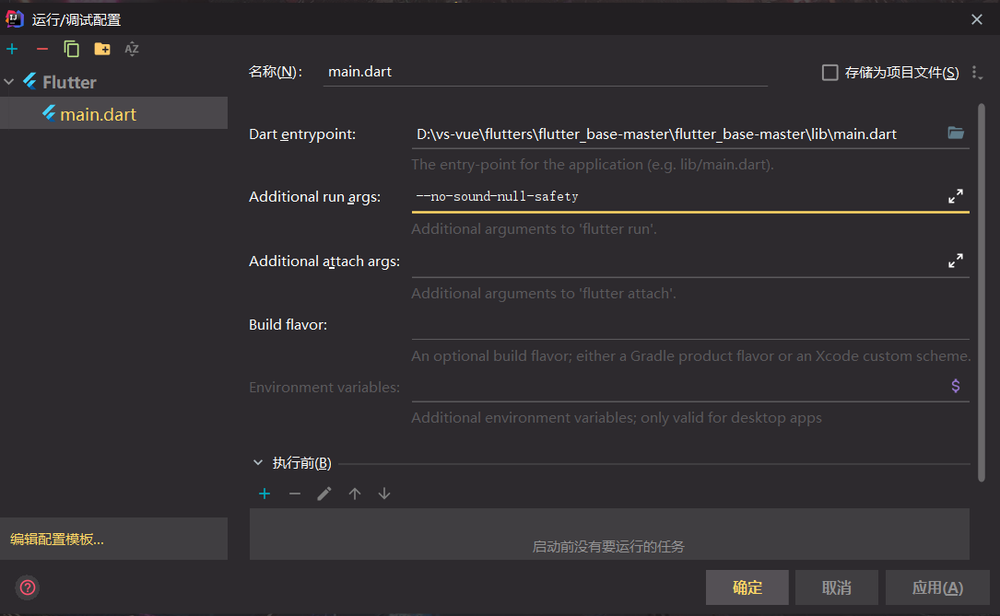

# flutter_project  

配置好了dio(请求后端),provide(状态管理),底部导航,路由

本人flutter版本3.3.7,dart版本2.18.4,项目里的依赖请根据自己本地环境来选择对应版本

请在启动参数里配置禁用空安全

# 如果需要修改app名字

参考 https://juejin.cn/post/6990187648329449508 (网上找的,不是我写的)

# 自动生成时命令行问题
- 项目名称?(projname)
